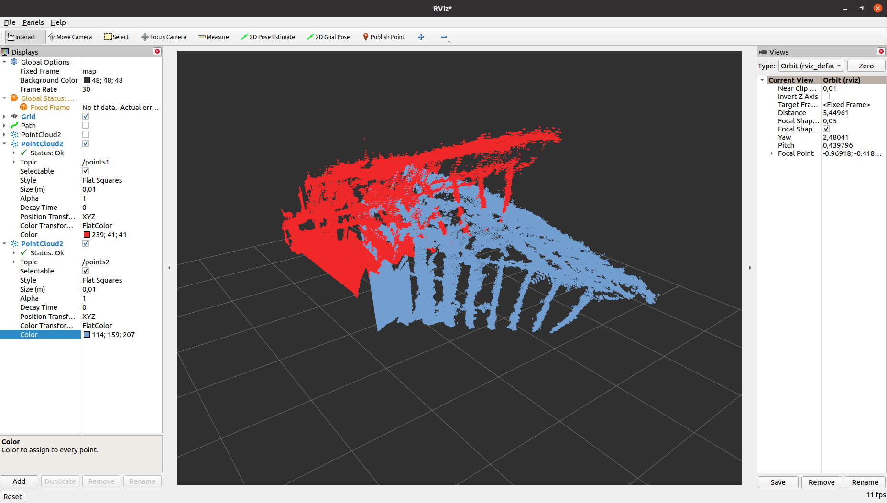
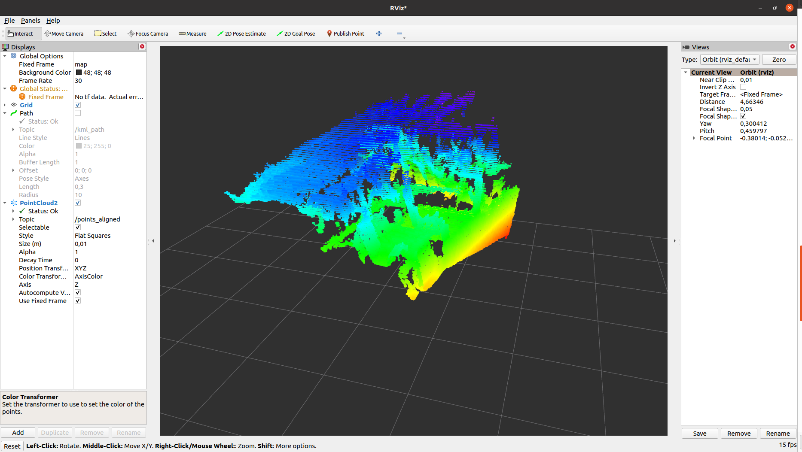
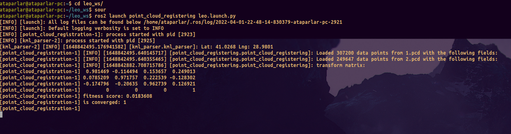
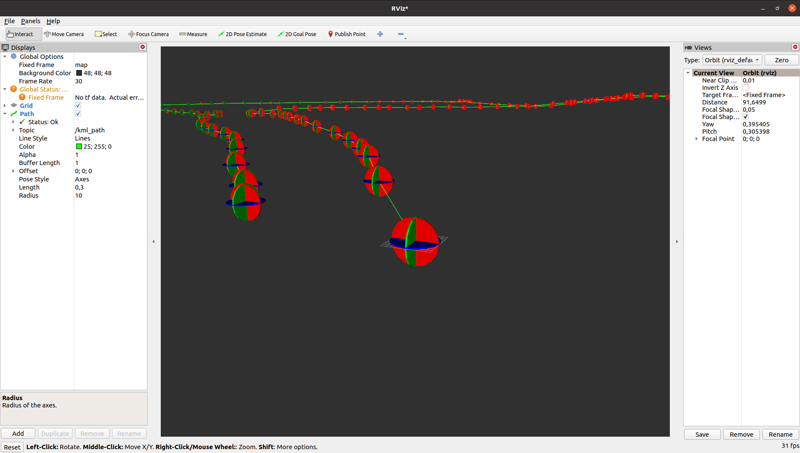
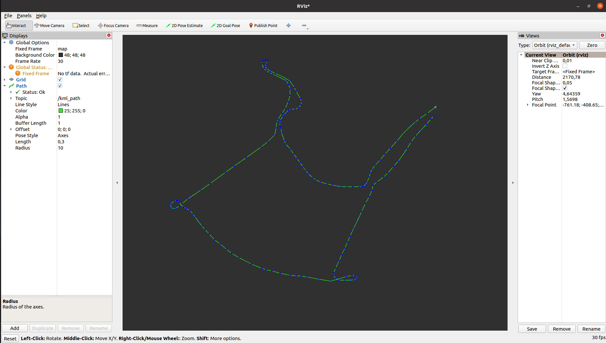

# Leo Drive Assignment
## Ata Parlar

This repo contains the Leo Drive Internship Assingment for localization sub-team.

### General Information
* Written with ROS2 and C++.
* `point_cloud_registering` package contains 2 ROS2 nodes.
  * These are `point_cloud_registering` and `kml_parser` nodes.
* Package has parameter files to specify the data directory paths.
  * Parameter files are in the `config` directory as `.yaml` files.
  * Data files are in the `data` directory.
  * These data files are 2 `.pcd` files and 1 `.kml` file.
  * **The data directory paths would be different for each computer. If you'll use the package, don't forget to change the data directory paths.**

### Dependencies
1. **ROS2**
2. **PCL 1.12**
3. **libkml**
4. **GeographicLib**

### Usage
After building the package in a ROS2 workspace, type
    <pre><code>ros2 launch point_cloud_registering leo.launch.py</code></pre>
    <pre><code>source install/local_setup.bash</code></pre> while in the top of your workspace directory.

#### point_cloud_registering node

* The `point_cloud_registering` node is written for registering the given point clouds into the one combined point cloud under the same frame.
* For matching the right points to the right points, aligning point clouds, combining aligned clouds, the *Generalized Iterative Closest Point* algorithm is used.
  * To apply the algorithm, *Point Cloud Library(PCL)* is used.
* All given `.pcd` files are written into a PCL Cloud and algorithm are run on this clouds.
  * Transform matrix between 2 given point clouds and error value are found.
* All given and generated PCL Clouds generated by algorithm is converted into a ROS2 Cloud and visualized on Rviz2.
  * Visualisation, transform matrix and error value can be seen below.

Seperate Point Clouds
 

Combined Point Cloud

Terminal Output

#### kml_parser node

* The `kml_parser` node is written for parsing and extracting the path via coordinates in the `.kml` files given.
* For extracting the coordinates from `.kml` file, *libkml* is used.
  * Coordinates in the file were assumed formatted as WGS84. In fact this has no matter, because all coordinates is converted into a local coordinate system via *GeographicLib*.
* After translation to the x, y, z coordinates, a local coordinate system is implemented which has the origin point as the first point in the line string coordinate array in the `.kml` file.
* After finding the local x, y, z coordinates, data is ready for the visualition. Path and coordinates are published on ROS2 and visualised in Rviz2.
  * These results can be seen below.

Coordinate Visualiation on Rviz2

Path Visualiation on Rviz2
